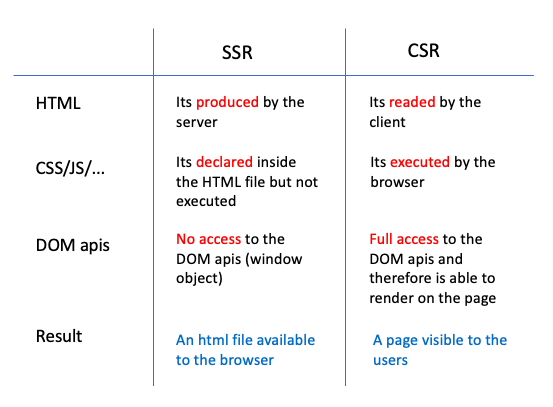

### What is rendering ?

Rendering is the process of retrieving a web page, launching the code, and assessing the structure and design of a page. Rendering can occur in a number of ways; client-side, server-side, and dynamic.

### Client Side Rendering ?

With a client-side rendering solution, you redirect the request to a single HTML file and the server will deliver it without any content (or with a loading screen) until you fetch all the JavaScript and let the browser compile everything before rendering the content.

Under a good and reliable internet connection, it’s pretty fast and works well. But it can be a lot better, and it doesn’t have to be difficult to make it that way. That’s what we will see in the following image.

- Note: `create-react-app` does client side rendering.

### What is Service Side Rendering

In SSR, when the user makes a request to the webpage, the server prepares the HTML page by fetching the required data from the database and sends to the user's machine over the internet. Then the browser presents all the requested actions on the user UI. All these processes of fetching data from the database to creating an HTML page and sending it to the client are done in mere milliseconds.

- Note: `npx create-next-app@latest` uses server side rendering.

### SSR vs CSR

### When to use server-side rendering

- An application has a very simple UI with fewer pages/features
- An application has less dynamic data
- Read preference of the site is more than write
- The focus is not on rich sites and has few users

### When to use client-side rendering

- An application has a very complex UI with many pages/features
- An application has large and dynamic data
- Write preference of the site is more than reading
- The focus is on rich sites and a huge number of users

### [Introduction to Next JS](https://nextjs.org/)

Next.js is an open-source web development framework created by Vercel enabling React-based web applications with server-side rendering and generating static websites.

- Created by Vercel
- ReactJS to production.

### Getting started
